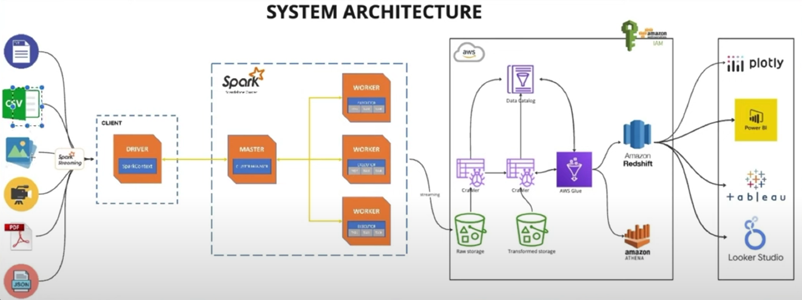

# Realtime Streaming Pipeline for Unstructured Data

This repository provides a guide and codebase for building a realtime streaming pipeline capable of handling various unstructured data types such as TEXT, IMAGE, VIDEO, CSV, JSON, and PDF. The pipeline is designed to process over 600+ different datasets in real-time. Below are the detailed steps to set up and deploy the pipeline.

## System Architecture Overview

The system architecture utilizes Spark Streaming for real-time data processing. It incorporates various components for data ingestion, processing, transformation, and storage, including AWS S3 for data storage and AWS Glue for data cataloging.

## System Architecture Design

The architecture is designed to handle the streaming of unstructured data from multiple sources. It includes modules for data schema creation, custom user-defined functions for data extraction, parsing and structuring of text data, integration with AWS services for storage and cataloging, and deployment on Spark clusters.

## Setting up Spark Streaming for Unstructured Data

- Install Apache Spark and set up a Spark cluster for streaming data processing.
- Configure Spark Streaming environment for real-time data ingestion and processing.

## Handling multiple unstructured data types

Implement mechanisms to handle various unstructured data types such as TEXT, IMAGE, VIDEO, CSV, JSON, and PDF efficiently within the Spark Streaming pipeline.

## Creating data schema

Define appropriate data schemas to organize and structure the incoming unstructured data streams.

## Creating custom user define functions for data extraction

Develop custom user-defined functions (UDFs) to extract relevant information from different unstructured data types.

## Parsing and extracting text data

Implement parsers and text extraction methods to process textual data extracted from unstructured sources.

## Structuring the results into a dataframe

Organize the extracted data into structured DataFrames for further processing and analysis.

## Reading JSON structured files into the streams

Integrate modules to read JSON structured files directly into the streaming pipeline.

## Joining Structured and Unstructured Data Streams

Merge structured and unstructured data streams using appropriate join operations to enrich the data.

## Writing Data to AWS S3 Bucket

Configure Spark Streaming to write the processed data to an AWS S3 bucket for storage and further analysis.

## Creating AWS Glue Crawler for the data

Set up AWS Glue Crawler to automatically discover and catalog the data stored in the S3 bucket.

## Verifying the crawler results on Athena

Verify the cataloging results by querying the data using AWS Athena.

## Deploying Spark Streams to Spark Clusters

Deploy the Spark Streaming pipeline onto Spark clusters for scalable and distributed real-time data processing.

## Verification of Results

Perform comprehensive testing and verification of the pipeline to ensure the accuracy and reliability of the results generated.
